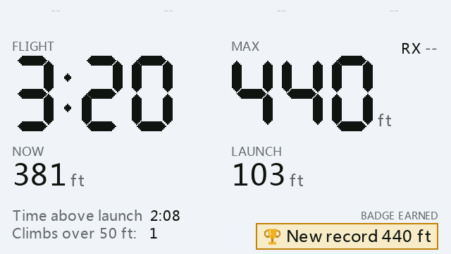
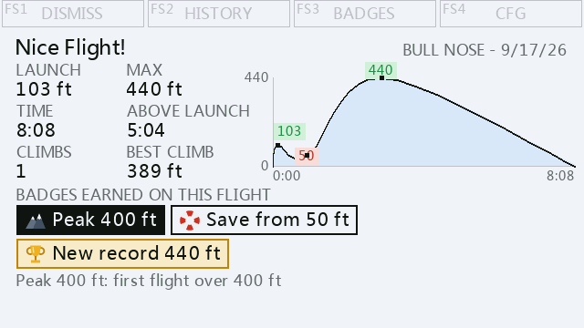
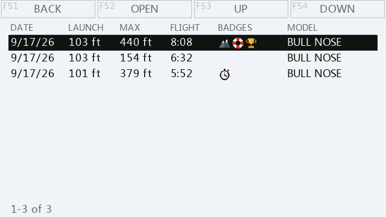

# Nice Flight!

A FrSky Ethos widget for DLG pilots that notices a good flight and celebrates it.
It watches every throw, logs all of them, and when a flight beats your own bar
(300 ft **or** 5 minutes by default) it shows a recap: launch height, max
altitude, flight time, time above launch height, climbs, a simplified altitude
graph, and the badges the flight earned.

Built for Mike Shellim's "DLG for Ethos" template (flight modes Launch = 2,
Zoom = 3, Landing = 4, and the launch button resetting the Altitude sensor).

## Screenshots

Captured from the FrSky Suite X14 simulator (Ethos 26.1.2) while replaying a
real logged flight: a 93 ft launch that sank to 49 ft, then climbed out to
440 ft.

| In flight | After landing |
|---|---|
|  |  |
| **Live.** Timer and max in large digits, with the latest badge earned in the air. | **Recap.** The numbers, the simplified graph, and every badge the flight earned. |

| History |
|---|
|  |
| **History.** Every nice flight, newest first, across all planes. |

"RX --" appears because the simulator does not feed the RX voltage sensor; on
a radio it shows the receiver pack voltage.

## Screens

| Screen | Shows |
|---|---|
| Live | flight timer and max side by side, current altitude, launch height, time above launch, climbs, RX voltage, and the latest badge earned in the air |
| Recap | the numbers, the graph, and every badge the flight earned |
| Idle | the last throw, today's nice flights of throws, best today |
| History | every nice flight, newest first, all planes |
| Badges | eight families with definitions, ladders, tallies and bests |

Keys follow FS1 to FS4 above the screen. Touch radios can tap the key labels.

## Badges

Peak, Duration, Yo-yo (three climbs all of at least N), Rebound (lose three
quarters of your height and climb back over it), Save from <60 ft (get under
60 ft, then climb out to 300), Hat trick (five nice flights in a day), Record
height and Record time. Badges belong to the pilot, not the plane. With Units
set to m, every ladder switches to a round metric ladder.

> **Pre-release, for field testing.** It has been developed against a harness
> and proven in the FrSky Suite simulator by replaying real logged flights,
> but as of 0.1.8 it has not yet flown on a real radio. It only reads
> telemetry and flight modes and writes its own CSV files; it never touches
> your model, mixes or trims.

## Requirements

- FrSky Ethos 26.1 or later (developed on an X14 with 26.1.2; X20-class radios
  get the same layout, with tap on the key labels).
- Mike Shellim's **DLG for Ethos** template, or a model whose flight modes
  match it: Launch = 2, Zoom = 3, Landing = 4, with the launch button
  resetting the Altitude sensor.
- A telemetry sensor named **Altitude**. RX voltage is read from `RxBatt` by
  default and can be pointed at another sensor in CFG.

## Install

1. Download the ZIP attached to the release (not GitHub's "Source code" ZIP).
   It holds `scripts/NiceFlt/` at the top level, which is what Ethos Suite's
   Lua installer and a manual copy both expect.
2. Ethos Suite: Lua Library > Install lua script > pick the ZIP. Or unzip it
   and copy the `scripts/NiceFlt` folder onto the radio so the path is
   `scripts/NiceFlt/main.lua`.
3. Reboot the radio. Ethos only scans scripts at boot.
4. Add a new main-screen page, choose the full-screen layout, and pick
   **Nice Flight!** as its widget.
5. Fly. Every throw is logged; a flight over 300 ft or 5 minutes lands on a
   recap, with a tone and a vibration.

Keys are FS1 to FS4 above the screen and work whenever the page is showing.
The rotary and ENTER need the widget focused first (press ENTER once). CFG
is on FS4 from the idle screen, or long-press the widget.

If a special function on your model switches screen pages at launch, the
radio will leave the Nice Flight! page at every throw. The flight is still
recorded; disable that function to watch the Live screen.

### Reporting back from a field test

After flying, copy `scripts/NiceFlt/Files/` off the radio and send it along
with what you saw. `diag.csv` is the trouble log (what the widget detected
and why), `flights.csv` has every throw, `badges.csv` every badge. An Ethos
telemetry log of the same session (Altitude plus the logic switches) lets a
flight be replayed exactly with `harness/replay.py`.

When upgrading, replace the `.lua` files and `icons/` only. `Files/` holds
your flights and badges.

## Development

```bash
pip3 install lupa
python3 harness/run.py        # executes the real widget code against mocked Ethos
python3 harness/render.py     # renders the real paint output to harness/out/*.svg
python3 tools/make_icons.py   # regenerates the badge icons
tools/deploy_sim.sh           # copies the widget into every simulator persist folder
```

## Testing in the simulator with real flights

`sim/NiceSim*/flight.lua` are FrSky Suite macros generated from real Ethos
telemetry logs. Each replays one real flight: the launch button (switch SG),
the elevator push that leaves Zoom, the logged altitude once a second, and
the brake, or ground frames for a hand catch. Toolbar > Run Macro > pick one
folder > Resume. Run them in order on a clean slate.

The macros replay at **8x** (`local SPEED = 8` at the top of each). Set
**CFG > Data > Simulator time scale to 8x** first, or every flight will be
measured eight times too short. All five then take about four minutes
instead of 38. At 8x the launch height reads about 10 ft high and a climb
can go uncounted, because the clock moves in 8 second steps; set both to 1
for an exact replay. The time scale is ignored on a real radio and the idle
screen shows TEST CLOCK while it is on.

| Macro | Real flight | Should produce |
|---|---|---|
| NiceSim1_NearMiss | 275 ft, 3:55 | not nice, no recap |
| NiceSim2_Duration | 379 ft, 5:15 | nice, Duration 5 min only |
| NiceSim3_NoBadge | 155 ft, 6:23 | nice by time, no badges (Duration 5 already held) |
| NiceSim4_SavePeak | 440 ft, 7:52, dipped to 49 ft | Peak 400, Save, Record height; hand catch |
| NiceSim5_Epic | 475 ft, 16:04 | Duration, Yo-yo, Rebound, both Records (low of 87 ft is not a Save) |

```bash
python3 harness/replay.py /Volumes/RADIO/logs/*.csv   # every flight in your logs, judged by the real code
python3 tools/make_macros.py /path/to/logs            # regenerate the macros
python3 harness/macro_check.py                        # run the macros, unmodified, against the real widget
```

The approved design lives in `mockup/nice_flight_mockup.html` and
`mockup/badges_screen.html`.
